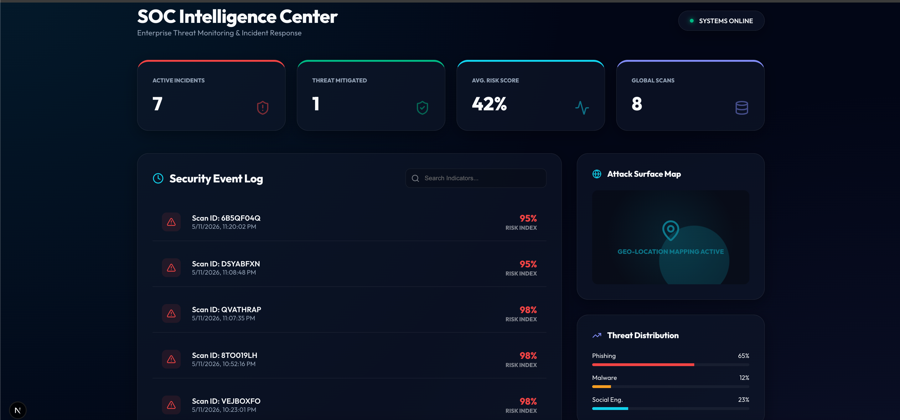
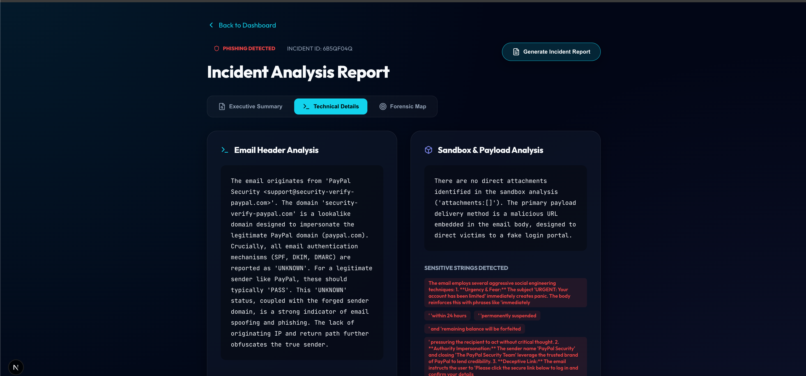
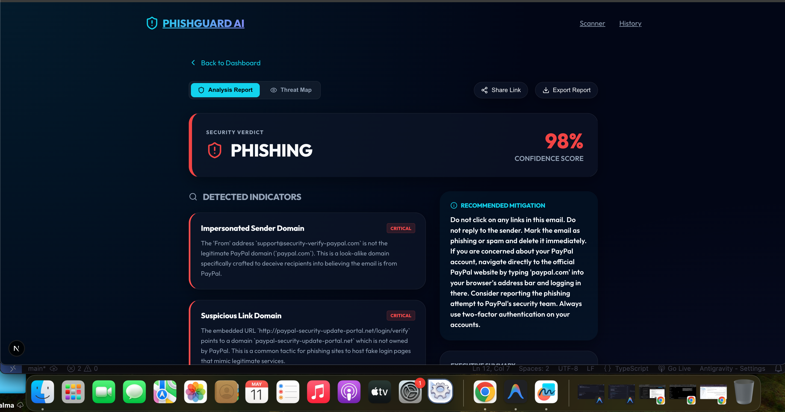
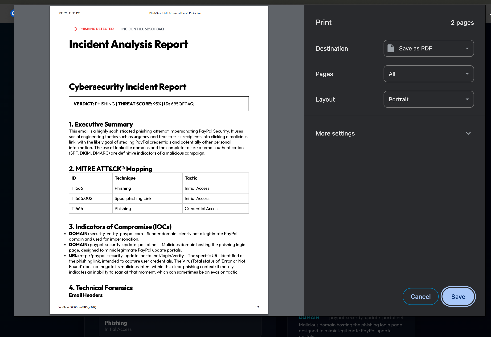
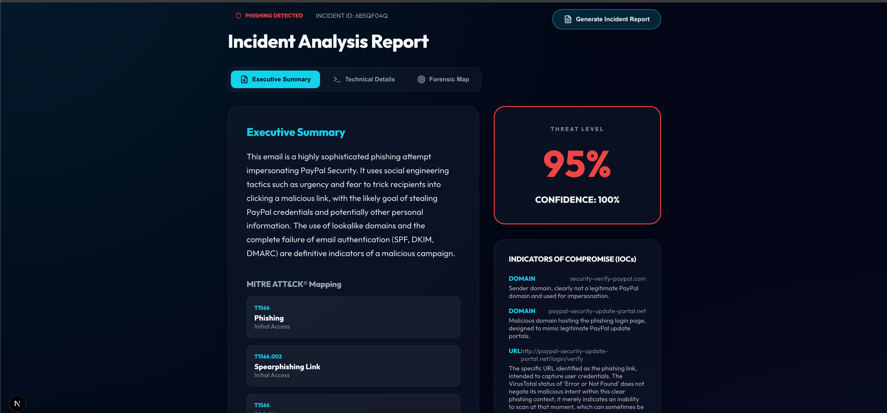
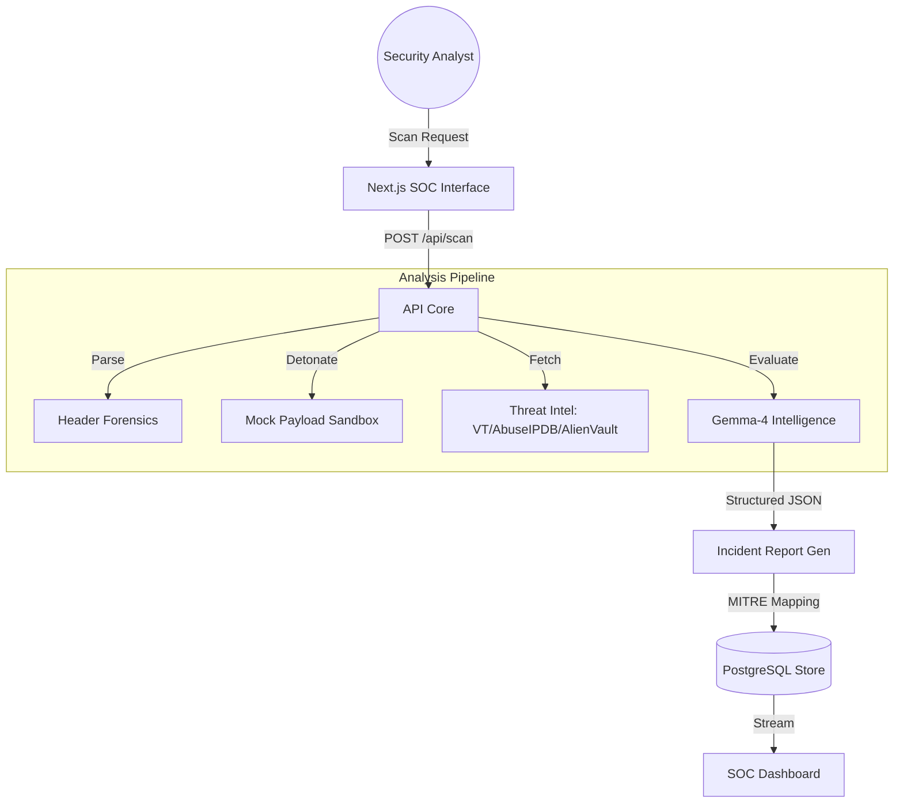

# 🛡️ PhishGuard AI - Enterprise Threat Intelligence Platform

PhishGuard AI is an industry-grade Security Operations Center (SOC) tool designed to automate the detection, analysis, and remediation of email-borne threats. It combines AI-driven contextual analysis (Gemma-4) with deep forensic header inspection and multi-engine threat intelligence.

## 📺 Live Demo

  <video src="https://raw.githubusercontent.com/rayan4-dot/PhishGuard/main/media/demo.mp4" width="100%" controls autoplay muted loop>
    Your browser does not support the video tag.
  </video>

## ✨ Core Features

- **SOC Intelligence Center**: Live monitoring dashboard with threat distribution, geo-mapping simulation, and attack trend analytics.
- **AI-Driven Incident Reporting**: Generates executive-ready security reports with **MITRE ATT&CK®** mapping and automated remediation steps.

## 📸 Platform Screenshots

  
  

  
  

  

## 🏗️ Architecture & Pipeline

## 🛠️ Technical Implementation

### AI Logic
The system uses a multi-indicator prompt engineering strategy. It feeds technical header data and sandbox flags into **Gemini 2.5 Flash** (via `gemma-4-31b-it` fallback), which performs cross-indicator correlation to determine if a "polite" email is actually a sophisticated spear-phishing attempt.

### Security Stack
- **AI Engine**: Google Gemini (Gemma-4 Logic)
- **Database**: Supabase (PostgreSQL)
- **Frontend**: Next.js 14+ / Framer Motion / Lucide
- **Infrastructure**: Docker / Prisma ORM

## 🔌 API Documentation
The API is fully documented at `/docs`. It supports programmatic integration for custom SIEM/SOAR pipelines.

---
Developed for professional portfolio demonstration. PhishGuard AI showcases senior-level engineering in AI, Security, and Enterprise UI/UX.
