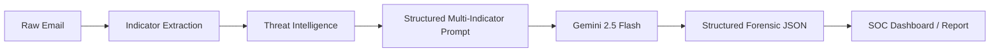

# 🏗️ PhishGuard AI - System Architecture

This document outlines the technical architecture, detection pipeline, and security considerations for the PhishGuard AI platform.

## 🛡️ Detection Pipeline

The platform follows a multi-stage ingestion and analysis workflow:

1.  **Ingestion Layer**: 
    - Supports raw email text, headers, and file uploads (`.eml`, `.txt`).
    - Performs initial sanitization and encoding normalization.

2.  **Forensic Extraction Engine**:
    - **Header Parser**: Extracts SMTP relay chains, SPF/DKIM/DMARC status, and originating IP addresses.
    - **Indicator Extractor**: Identifies URLs, domains, and suspicious file attachments using heuristic regex patterns.

3.  **Intelligence Augmentation**:
    - **URL Reputation**: Queries VirusTotal v3 for real-time domain reputation.
    - **IP Reputation**: Cross-references originating IPs against AbuseIPDB and AlienVault OTX databases (simulated).
    - **Sandbox Simulation**: Analyzes attachment metadata for high-entropy payloads and suspicious extensions (e.g., `.pdf.exe`).

4.  **Cognitive Analysis (AI Engine)**:
    - **Model**: Gemini 2.5 Flash / Gemma-4.
    - **Contextual Correlation**: Correlates technical forensics (e.g., SPF fail) with linguistic cues (e.g., urgency) to generate a final verdict.
    - **MITRE Mapping**: Maps identified tactics to the MITRE ATT&CK® framework.

5.  **Persistence & Reporting**:
    - Data is stored in **Supabase (PostgreSQL)** via **Prisma ORM**.
    - Generates structured **Cybersecurity Incident Reports** for SOC analysts.

## 🧠 AI Workflow

## 🔒 Security Considerations

- **Data Privacy**: No email content is used for model training. Analysis is performed in isolated inference sessions.
- **Indicator Obfuscation**: The platform uses `shortId` fields to mask sensitive internal database IDs when sharing report links.
- **Rate Limiting**: Implemented at the API gateway level to prevent DDoS attacks and API quota exhaustion.
- **Safe Detonation**: All attachment analysis is performed via metadata inspection; no actual binaries are executed on the server.

## 🔌 API-First Design

PhishGuard is designed as an API-first platform, allowing seamless integration with existing SIEM/SOAR tools (e.g., Splunk, Palo Alto Cortex XSOAR).

---
*Version 1.0.0 | PhishGuard Security Team*
